"# AI-FinalProject-KouroshHassanzadeh" 


# Environment Setup

Windows:

```
python -m venv env

env\Scripts\activate

pip install -r requirements.txt
```
Linux:

```
python3 -m venv env

source env/bin/activate

pip install -r requirements.txt
```

# EDA Analysis

```
python utils\eda\eda.py
```

The outputs will be saved beside the script.

# Data

You can find the datasets in the `data` directory.  
The data used for each problem is different.

All data:


# Spatial and Frequency Filters

Applying Average, gaussian, median, sharpening, sobel in spatial domain and High Pass and Low Pass in frequency domain.

```
python src\spatial_frequency_filters.py
```

results:


# Denoising

Applying Salt&Pepper and gaussian noise and remove them with median and bilateral filters.

```
python src\denoising.py
```

results:

s&p + median:


gaussian + bilateral:


# Edge Detection

Applying prewitt, kirsch, Marr_Hildreth, canny Algorithms.

```
python src\edge_detection.py
```

results:

prewitt:


kirsch:


Marr_Hildreth:


canny:


# Segmentation

Applying Kmeans at pixel level with different k

```
python src\segmentation.py
```

k = 8:

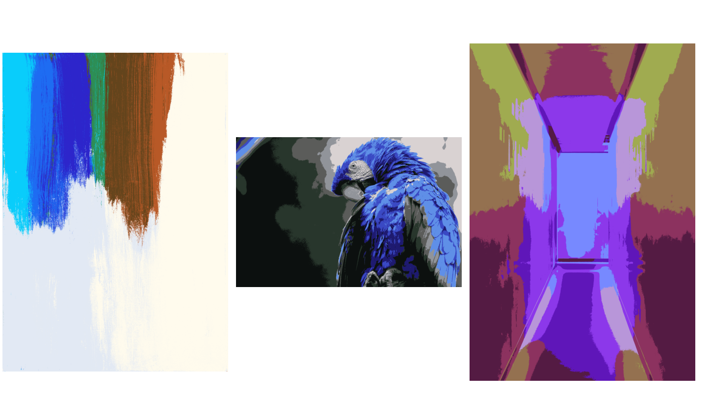

k = 16:

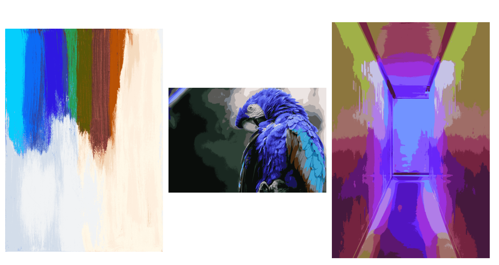

k = 32:


# Thresholding

Applying simple threshold, adaptive mean threshold, adaptive gaussian threshold, otsu threshold

```
python src\thresholding.py
```

results:

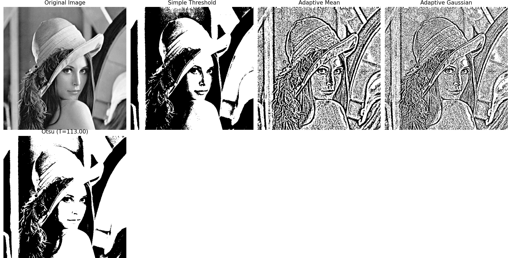

# Histogram Analysis

Applying hog

```
python src\histogram.py
```

results:

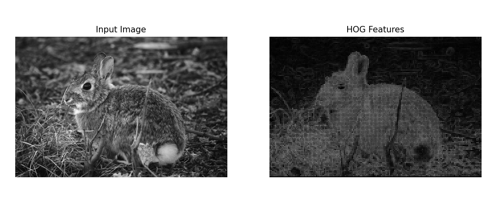

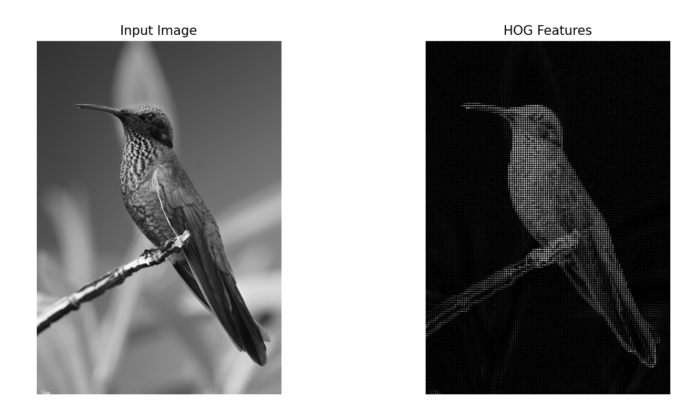

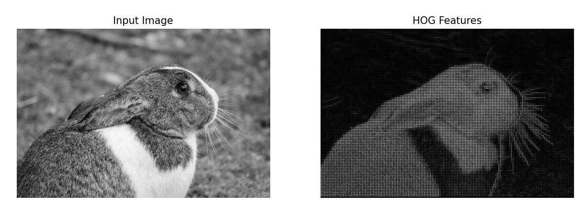


# AutoEncoder for Denoising

data: fashion mnist

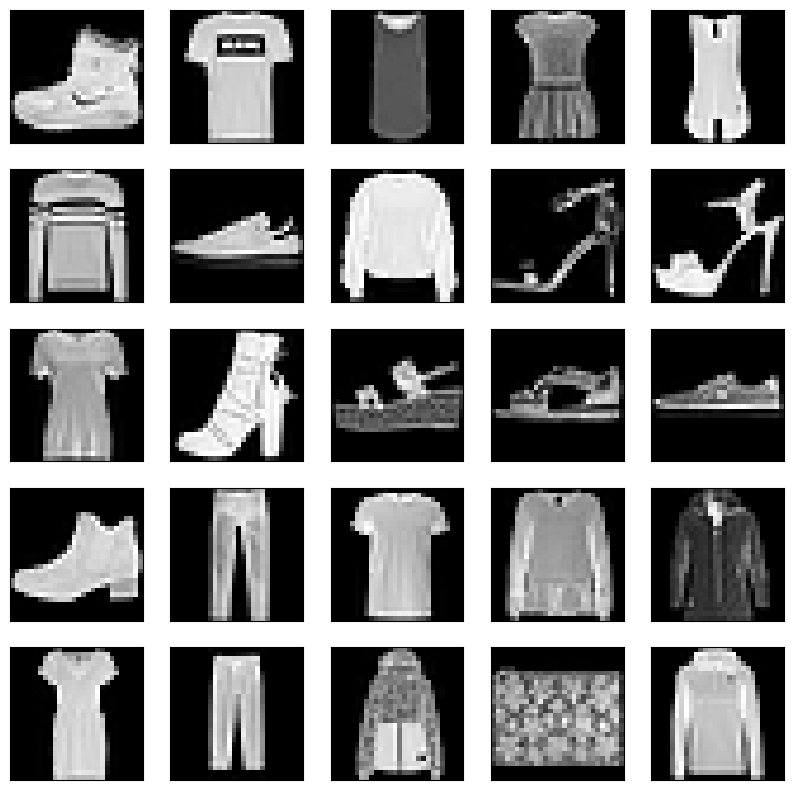

we add noise to images:

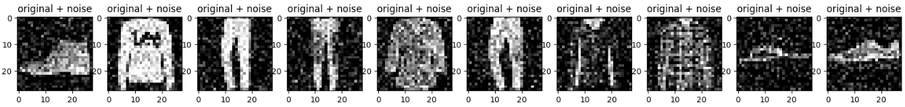


model architecture:

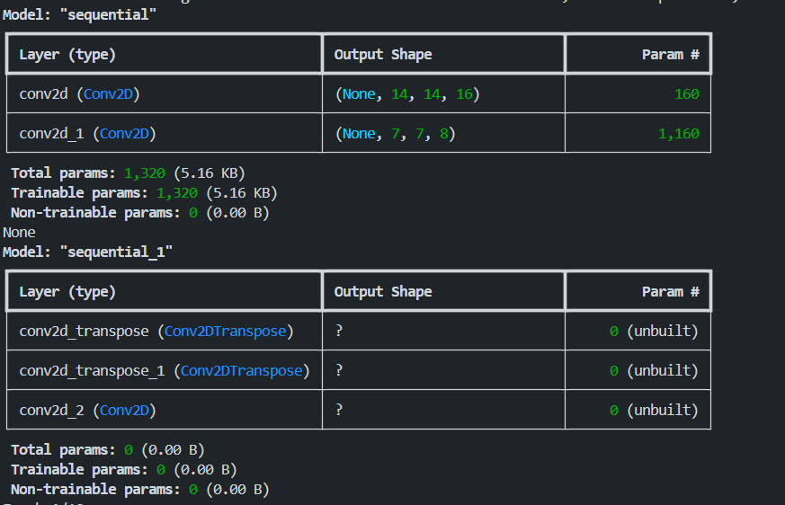


we trained it `Adam` optimizer and `MSE` loss function. we trained the model within 10 epochs with early stopping.

```
python src\AutoEncoder\train.py
```

final epoch result:

`loss: 0.0071 - val_loss: 0.0072`


# Evaluation:

```
python src\AutoEncoder\evaluate.py
```

metrics for test data:

```
MSE      : 0.007488
MAE      : 0.047937
PSNR mean: 21.6279
SSIM mean: 0.7586
```

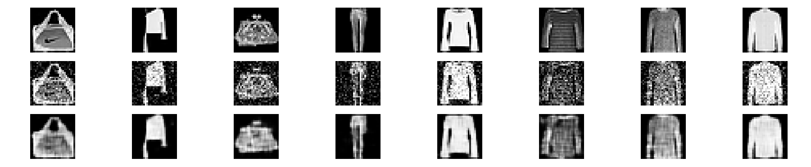

The first row contains original images. the second row contains noisy image and the third row contains reconstructed images.

# Inference

We write an inference script that takes an input and add noise to it and reconstruct it using our AutoEncoder.

```
python src\AutoEncoder\inference.py
```

results:

We tested it on a new data from hand written digits(mnist) and the results is as below:

```
noise_factor=0.2
MSE : 0.034839
MAE : 0.133155
PSNR: 14.5794
SSIM: 0.8240
```

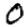