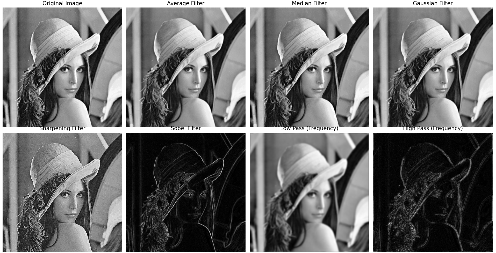
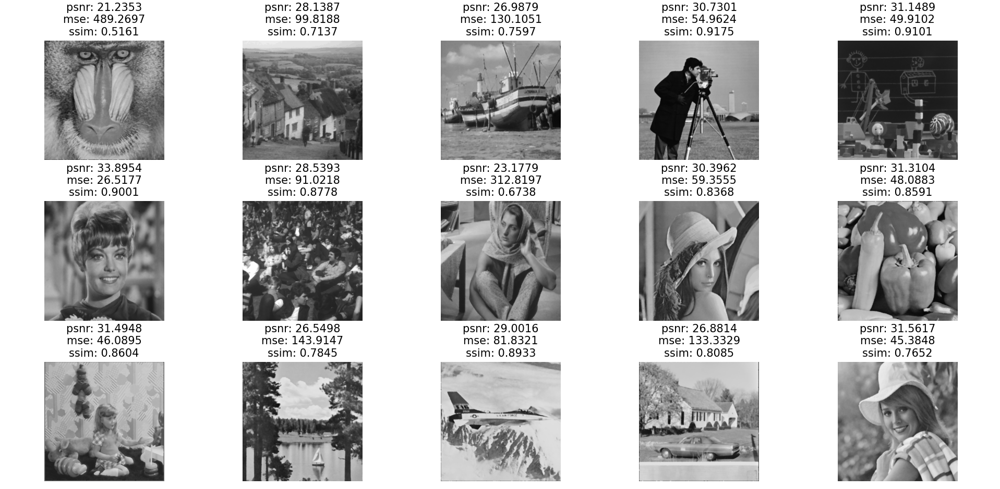
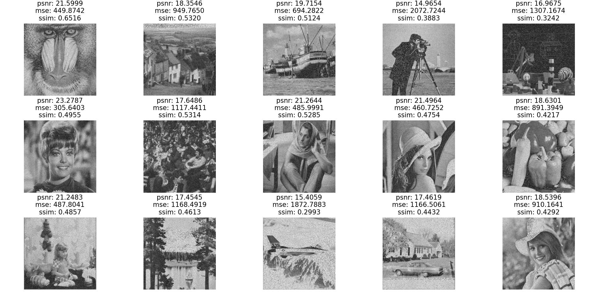
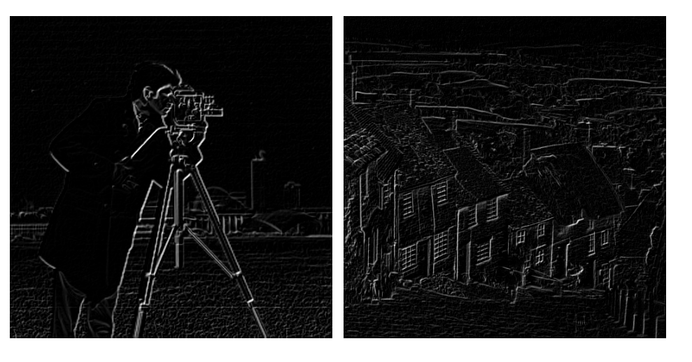
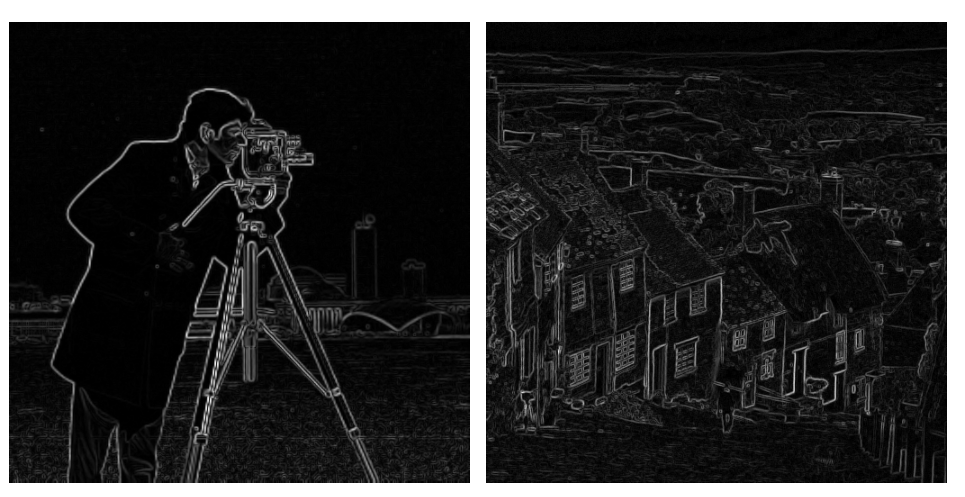
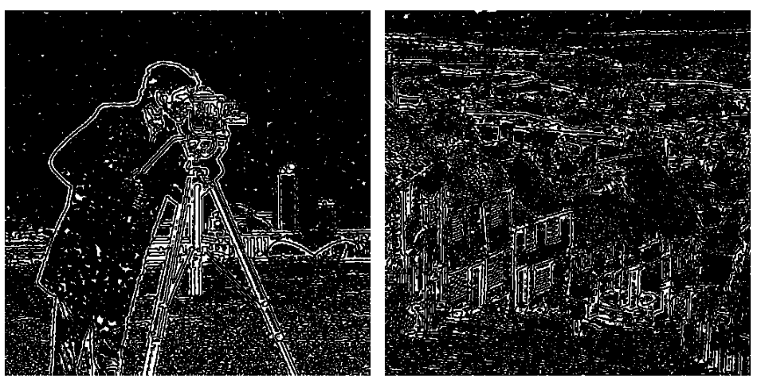
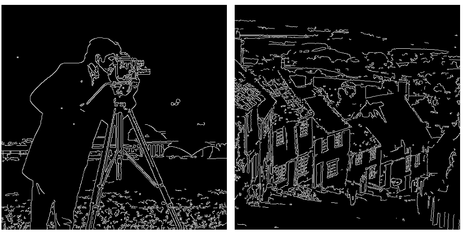

"# AI-FinalProject-KouroshHassanzadeh" 


# Environment Setup

Windows:

```
python -m venv env

env\Scripts\activate

pip install -r requirements.txt
```
Linux:

```
python3 -m venv env

source env/bin/activate

pip install -r requirements.txt
```

# EDA Analysis

```
python utils\eda\eda.py
```

The outputs will be saved beside the script.

# Data

You can find the datasets in the `data` directory.  
The data used for each problem is different.

All data:


# Spatial and Frequency Filters

Applying Average, gaussian, median, sharpening, sobel in spatial domain and High Pass and Low Pass in frequency domain.

```
python src\spatial_frequency_filters.py
```

results:


# Denoising

Applying Salt&Pepper and gaussian noise and remove them with median and bilateral filters.

```
python src\denoising.py
```

results:

s&p + median:



gaussian + bilateral:



# Edge Detection

Applying prewitt, kirsch, Marr_Hildreth, canny Algorithms.

```
pyton src\edge_detection.py
```

results:

prewitt:



kirsch:



Marr_Hildreth:



canny:

