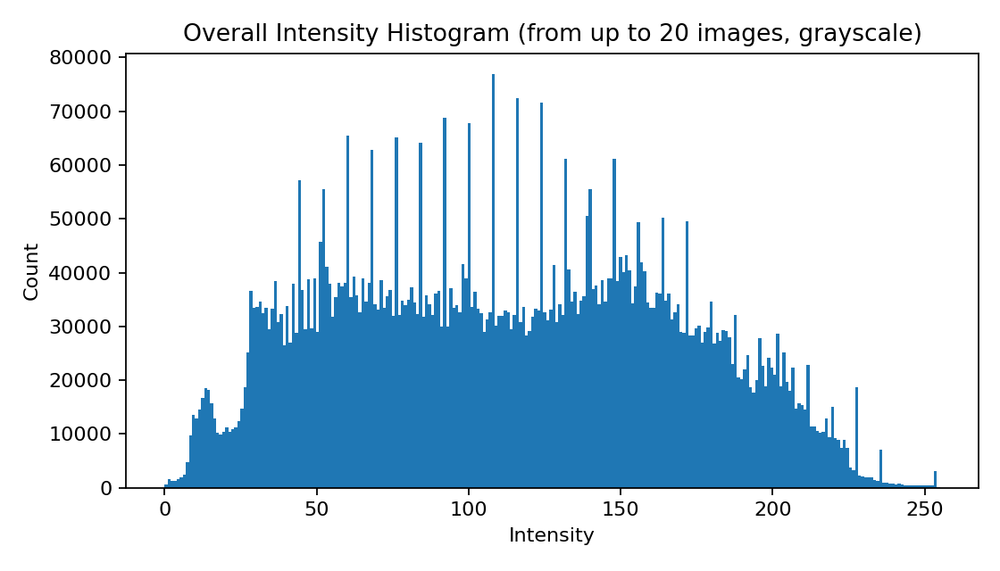
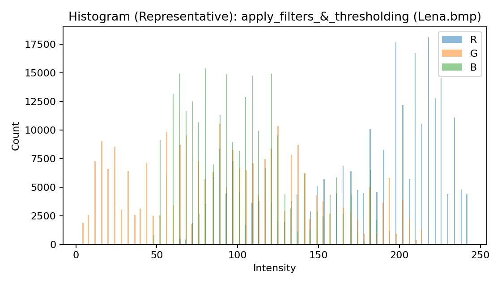
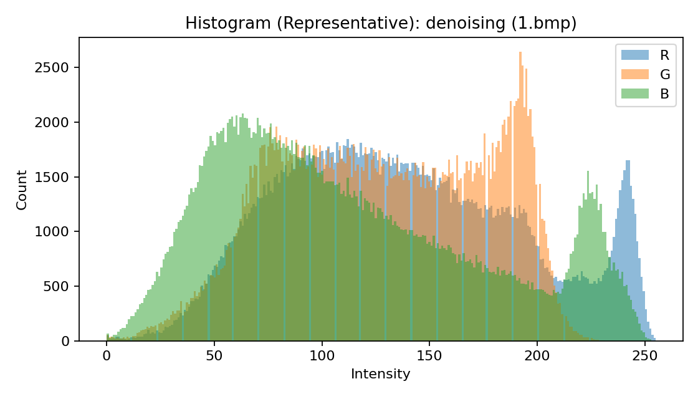
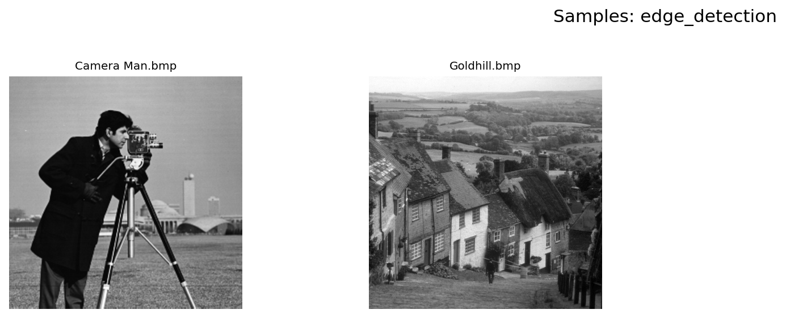
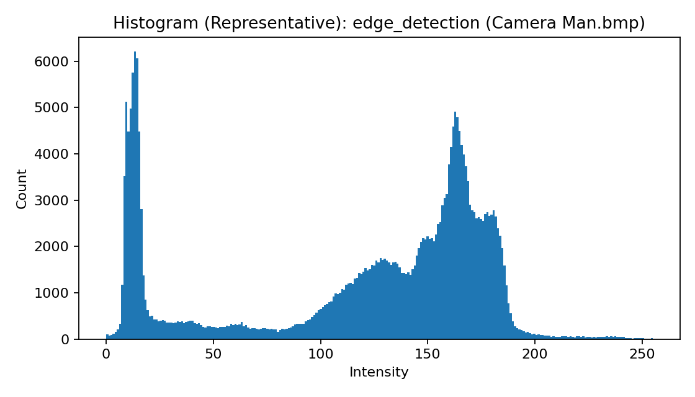
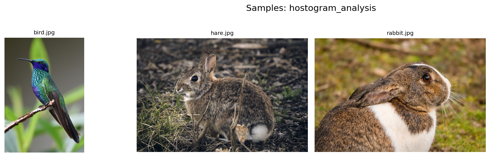
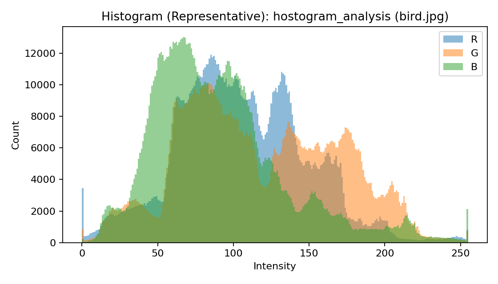
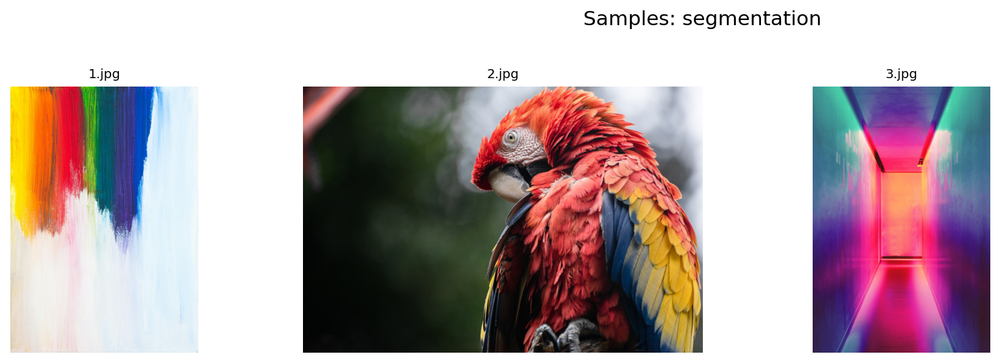
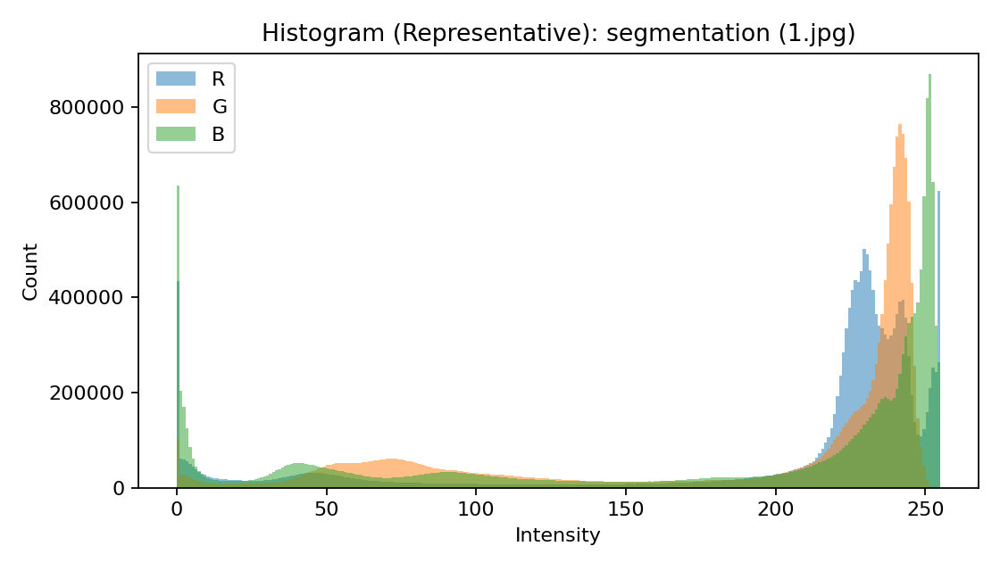

# Image Dataset EDA Report

- Data root: `data`
- Generated: `2026-02-12T23:25:06`
- Total images read: **24**

## Overall Summary

- Unique channel counts: **[1, 3]**
- Dtypes: **['uint8']**
- Height (px): min=512, max=4834, mean=943.9, std=1176.4
- Width (px): min=512, max=3359, mean=855.0, std=778.3
- Pixel mean: min=57.95, max=189.12, mean=118.99, std=29.06
- Pixel std: min=40.41, max=80.28, mean=55.21, std=9.96

### Sample Grid (Overall)

### Intensity Histogram (Overall, Grayscale)

## Per-Folder Summaries

| folder | count | channels | dtypes | unique_sizes_top |
| --- | --- | --- | --- | --- |
| apply_filters_&_thresholding | 1 | [3] | ['uint8'] | [(512, 512, 3)] |
| denoising | 15 | [1, 3] | ['uint8'] | [(512, 512, 1), (512, 512, 3)] |
| edge_detection | 2 | [1] | ['uint8'] | [(512, 512, 1)] |
| hostogram_analysis | 3 | [3] | ['uint8'] | [(853, 1280, 3), (854, 1280, 3), (1280, 883, 3)] |
| segmentation | 3 | [3] | ['uint8'] | [(853, 1280, 3), (4763, 3359, 3), (4834, 3223, 3)] |

### `apply_filters_&_thresholding`

- Images: **1**
- Channels: **[3]**
- Dtypes: **['uint8']**
- Unique sizes (top): **[(512, 512, 3)]**

#### File-level Preview (first 20)

| file | shape | dtype | mean | std | min | max |
| --- | --- | --- | --- | --- | --- | --- |
| apply_filters_&_thresholding\Lena.bmp | 512x512x3 | uint8 | 124.54 | 59.40 | 4 | 242 |

### `denoising`

- Images: **15**
- Channels: **[1, 3]**
- Dtypes: **['uint8']**
- Unique sizes (top): **[(512, 512, 1), (512, 512, 3)]**

#### File-level Preview (first 20)

| file | shape | dtype | mean | std | min | max |
| --- | --- | --- | --- | --- | --- | --- |
| denoising\1.bmp | 512x512x3 | uint8 | 126.46 | 56.19 | 0 | 255 |
| denoising\10.bmp | 512x512x1 | uint8 | 112.24 | 49.30 | 20 | 236 |
| denoising\11.bmp | 512x512x1 | uint8 | 129.71 | 46.68 | 0 | 255 |
| denoising\12.bmp | 512x512x1 | uint8 | 118.31 | 62.00 | 0 | 255 |
| denoising\13.bmp | 512x512x1 | uint8 | 57.95 | 40.41 | 16 | 242 |
| denoising\14.bmp | 512x512x1 | uint8 | 111.12 | 41.20 | 21 | 209 |
| denoising\15.bmp | 512x512x1 | uint8 | 84.71 | 50.42 | 31 | 254 |
| denoising\2.bmp | 512x512x3 | uint8 | 111.37 | 52.67 | 0 | 255 |
| denoising\3.bmp | 512x512x3 | uint8 | 124.54 | 59.40 | 4 | 242 |
| denoising\4.bmp | 512x512x3 | uint8 | 110.64 | 66.18 | 0 | 237 |
| denoising\5.bmp | 512x512x3 | uint8 | 140.53 | 56.18 | 1 | 247 |
| denoising\6.bmp | 512x512x3 | uint8 | 123.40 | 68.06 | 0 | 249 |
| denoising\7.bmp | 512x512x3 | uint8 | 181.88 | 44.00 | 0 | 234 |
| denoising\8.bmp | 512x512x3 | uint8 | 155.29 | 54.85 | 0 | 255 |
| denoising\9.bmp | 512x512x1 | uint8 | 136.36 | 46.06 | 0 | 243 |

### `edge_detection`

- Images: **2**
- Channels: **[1]**
- Dtypes: **['uint8']**
- Unique sizes (top): **[(512, 512, 1)]**

#### File-level Preview (first 20)

| file | shape | dtype | mean | std | min | max |
| --- | --- | --- | --- | --- | --- | --- |
| edge_detection\Camera Man.bmp | 512x512x1 | uint8 | 118.31 | 62.00 | 0 | 255 |
| edge_detection\Goldhill.bmp | 512x512x1 | uint8 | 112.24 | 49.30 | 20 | 236 |

### `hostogram_analysis`

- Images: **3**
- Channels: **[3]**
- Dtypes: **['uint8']**
- Unique sizes (top): **[(853, 1280, 3), (854, 1280, 3), (1280, 883, 3)]**

#### File-level Preview (first 20)

| file | shape | dtype | mean | std | min | max |
| --- | --- | --- | --- | --- | --- | --- |
| hostogram_analysis\bird.jpg | 1280x883x3 | uint8 | 104.29 | 47.27 | 0 | 255 |
| hostogram_analysis\hare.jpg | 853x1280x3 | uint8 | 76.57 | 43.32 | 0 | 255 |
| hostogram_analysis\rabbit.jpg | 854x1280x3 | uint8 | 113.06 | 55.32 | 0 | 255 |

### `segmentation`

- Images: **3**
- Channels: **[3]**
- Dtypes: **['uint8']**
- Unique sizes (top): **[(853, 1280, 3), (4763, 3359, 3), (4834, 3223, 3)]**

#### File-level Preview (first 20)

| file | shape | dtype | mean | std | min | max |
| --- | --- | --- | --- | --- | --- | --- |
| segmentation\1.jpg | 4763x3359x3 | uint8 | 189.12 | 80.28 | 0 | 255 |
| segmentation\2.jpg | 853x1280x3 | uint8 | 76.32 | 72.03 | 0 | 255 |
| segmentation\3.jpg | 4834x3223x3 | uint8 | 116.92 | 62.61 | 0 | 255 |
